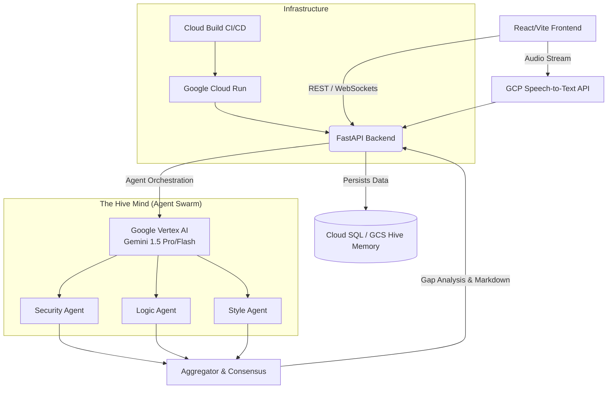

<div align="center">
  
  <h1>Bhramari 🐝 <br/> <small>The Always-On Multi-Lingual Autonomous Hive Mind</small></h1>
  <p>
    <strong>Bhramari isn't a static code analyzer. It's an intelligent, voice-native swarm of specialized AI agents designed to democratize code review and radically eliminate technical debt.</strong>
  </p>
  <p>
    <a href="https://bhramari-api-235116528765.us-central1.run.app"><strong>View Live Demo</strong></a> · <a href="#-the-core-problem"><strong>Problem</strong></a> · <a href="#-the-moat-why-bhramari-is-unique"><strong>The Moat</strong></a> · <a href="#%EF%B8%8F-architecture"><strong>Architecture</strong></a>
  </p>
</div>

<hr/>

## 🛑 The Core Problem

Modern CI/CD pipelines and static code analyzers (like SonarQube, ESLint, or Checkmarx) are rigid, rule-based, and inherently lack deep contextual understanding of business logic. 

**The result?**
- **False Positives:** Developers are overwhelmed by hundreds of irrelevant warnings.
- **Gatekeepers, Not Collaborators:** They act as blockades rather than intelligent pairing partners.
- **The Language Barrier:** Traditional tools are highly anglocentric and alienated from non-native English speakers. This creates a massive barrier for diverse engineering teams globally, especially in rapid-growth regions like India.

## 💡 The Solution: Bhramari

Bhramari replaces static gatekeepers with an intelligent, conversational, and autonomous swarm of specialized AI agents. It leverages the power of Large Language Models to contextually understand code, converse with developers in their native language (including via voice), and output highly structured, directly actionable gap analyses.

---

## 🏰 The Moat: Why Bhramari is Unique

Bhramari is fundamentally built differently from wrappers around single LLM prompts. Our defensibility and unique value proposition stem from three core pillars:

### 1. The "30 Bees" Multi-Agent Swarm (MoE Approach)
Instead of sending code to a single, easily confused, monolithic prompt, Bhramari spawns specialized "bees" (agents). 
- 🛡️ **The Security Drone:** Hunts strictly for SQLi, XSS, and hardcoded secrets.
- 🧠 **The Logic Wasp:** Checks algorithmic complexity and edge-case handling.
- 🎨 **The Style Bee:** Enforces PEP8, Clean Code principles, and structural integrity.
- 🌍 **The Cultural Drone:** Handles localization and idiom translation.

These agents evaluate code **concurrently**, cross-checking findings to radically reduce AI hallucinations. It mimics how 30 bees in a hive collaborate to build a geometrically perfect honeycomb.

### 2. Voice-Native & Multilingual Code Reviews
Built explicitly to bridge language barriers. A developer can upload code, click the microphone, and dictate in mixed context (e.g., Hindi + English): *"Bhai, is code mein security vulnerabilities check karna"* (Brother, check for security vulnerabilities in this code). Bhramari processes the audio context alongside the code natively using Google Cloud Speech-to-Text.

### 3. Hive Memory (Historical Context Engine)
Bhramari learns from your team's historical patterns. Every past mistake becomes institutional knowledge, preventing regressions dynamically—something static analyzers cannot do without writing tedious manual regex rules.

---

## 🏗️ Architecture & GCP Tech Stack

Bhramari is built on a robust, highly scalable event-driven architecture heavily powered by Google Cloud.



### Stack Breakdown:
*   **Google Vertex AI (Gemini 1.5 Pro / Flash):** Powers the multi-agent swarm logic. The massive context window and speed of Gemini makes real-time multi-agent orchestration possible with near-zero latency.
*   **Google Cloud Speech-to-Text (STT) API:** Handles robust, noisy, multilingual voice prompt transcription directly from the browser's audio stream.
*   **Google Cloud Run:** Hosts the containerized FastAPI backend and React frontend. It autoscales to zero to save costs and scales up in milliseconds during high concurrent loads.
*   **Google Cloud Build:** Powers our automated CI/CD pipeline, taking code directly from GitHub, containerizing it, and pushing it to Cloud Run.
*   **Google Cloud Storage (GCS) & Cloud SQL:** Acts as the secure, durable storage layer for our **Hive Memory**, storing the historical organizational patterns that the agents learn from.
*   **React (Vite) + Tailwind + Framer Motion:** Delivers a highly fluid, premium, glass-morphic UI on the frontend.

---

## 🚀 Getting Started

### Prerequisites
- Node.js (v18+)
- Python 3.10+
- Google Cloud Service Account credentials (with Vertex AI and Speech-to-Text enabled)

### Local Development

**1. Clone the repository:**
```bash
git clone https://github.com/z99wE/bhramari.git
cd bhramari
```

**2. Start the Backend (FastAPI):**
```bash
cd backend
python -m venv venv
source venv/bin/activate  # On Windows: venv\Scripts\activate
pip install -r requirements.txt

# Set up your GCP credentials
export GOOGLE_APPLICATION_CREDENTIALS="/path/to/your/service-account.json"
export PROJECT_ID="your-gcp-project-id"

uvicorn main:app --reload --port 8000
```

**3. Start the Frontend (React):**
```bash
cd frontend
npm install
npm run dev
```

### The Output Loop
1. Upload code.
2. Speak your context prompt.
3. Initiate the Swarm.
4. Review the **Gap Analysis Dashboard**.
5. Download the **IDE-ready Markdown Report** to drag directly into Cursor / GitHub Copilot for an autonomous fix loop.

---

<div align="center">
  <p>Built for the future of collaborative, intelligent engineering.</p>
</div>
